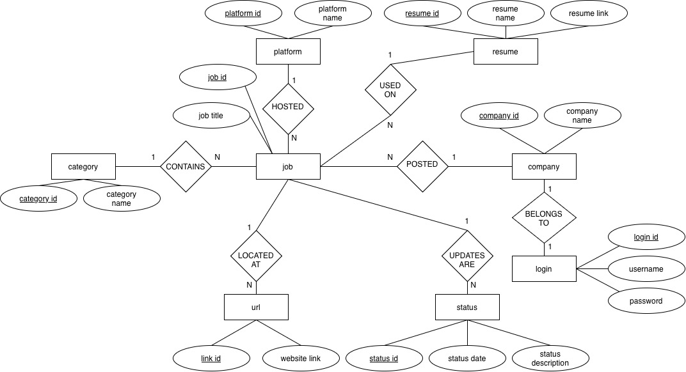

# About
MySQL Client and MySQL Database to help user keep track of the job applications.

# Intended Features
- Allow users to add job listings ( job title, company, job search platform, date )
    - NOTE: date is not stored job_listing table, but rather stored in job_status
- Allow users to see how many jobs they apply to daily (on average)
- Allow users to see how many jobs they have applied within a specified date range (important)
    - day
    - week
    - month
    - year
- Allow users to track status of job applications ( job, status, date )
    - Applied
    - Phone Screening
    - Interview
    - Rejected
- Allow users to see which resume is getting the most interviews
- Allow users to categorize job applications. Allow users to see how many of each they have applied. Examples would be:
    - Software engineering
    - Electrical engineering
    - Marketing
- Allow users to search what companies they have applied to
    - What companies the user has applied to the most
- Allow users to search what job search platforms they use
    - What job search platform they use the most

# Database Diagram


# Setup

Create a .env
```env
MYSQL_USER=value_here
MYSQL_PASSWORD=value_here
MYSQL_HOST=value_here
MYSQL_DATABASE=value_here
```

```bash
chmod +x run_client.bash
```

Run Makefile to generate code:

```bash
make # produces my_client
```

```bash
./run_client.bash
```

## For running debug

Go to project root.

```bash
set -a
. ./.env
set +a
lldb build/jacli
```

# Note to Self
I created the databse in mysql homebrew installation.

To obtain schema, I ran this command:
```bash
# mysqldump -u [username] -p jobapps > jobapps.sql
mysqldump -u [username] -p --no-data jobapps > jobapps.sql
```
